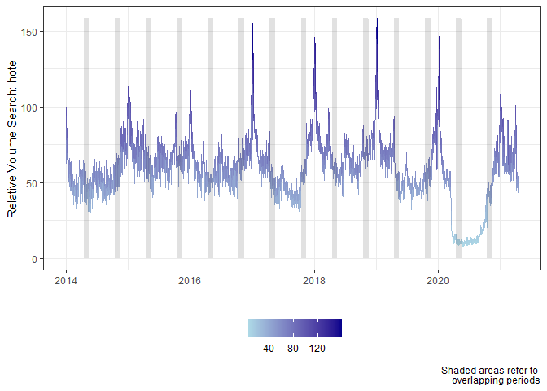

<!-- README.md is generated from README.Rmd. Please edit that file -->

# ninTrenDo

<!-- badges: start -->
<!-- badges: end -->

The goal of *ninTrenDo* is to perform long-term high frequency Google
Trends queries by overlapping. This package let you to reconstruct
Google Trends high frequency data for extended periods. Using
overlapping windows and letting for long-term trend correction, this
package allows the search for any single query of daily, weekly, monthly
or quarterly frequency, covering longer periods than those allowed by
Google Trends direct search.

## Installation

You can install the released version of ninTrenDo from
[CRAN](https://CRAN.R-project.org) with:

``` r
install.packages("ninTrenDo")
```

And the development version from [GitHub](https://github.com/) with:

``` r
# install.packages("devtools")
devtools::install_github("ssaninre22/ninTrenDo")
```

## Example

These are two basic examples which show you how to use this package’s
functions in order to obtain Google Trends high frequency data. The
first example shows how to obtain daily data for the word **hotel** in
Colombia (CO) during the period January 1st, 2014 until April 16, 2021.

``` r
library(ninTrenDo)
## basic example code
res <- long_gt(keyword = "hotel",geo="CO",
                 input.sdate = as.Date("2014-01-01"),
                 input.edate = as.Date("2021-04-16"),
                 input.frequency = "d",input.delta = 6,
                 input.ol.win = 1,input.type="web",input.categ=0)
#> [1] "GT sample = 1/15"
#> [1] "GT sample = 2/15"
#> [1] "GT sample = 3/15"
#> [1] "GT sample = 4/15"
#> [1] "GT sample = 5/15"
#> [1] "GT sample = 6/15"
#> [1] "GT sample = 7/15"
#> [1] "GT sample = 8/15"
#> [1] "GT sample = 9/15"
#> [1] "GT sample = 10/15"
#> [1] "GT sample = 11/15"
#> [1] "GT sample = 12/15"
#> [1] "GT sample = 13/15"
#> [1] "GT sample = 14/15"
#> [1] "GT sample = 15/15"

res$plot
```



The second example conducts the same query but it corrects the output by
using long-term search index by using temporal dissagregation of monthly
data based on the daily long-term index built by overlapping windows.

``` r
library(ninTrenDo)
## basic example code
res <- long_gt_ltc(keyword = "hotel",geo="CO",
                 input.sdate = as.Date("2014-01-01"),
                 input.edate = as.Date("2021-05-01"),
                 input.frequency = "d",td.method="chow-lin",
                 input.delta = 5,
                 input.ol.win = 1)
#> [1] "GT sample = 1/18"
#> [1] "GT sample = 2/18"
#> [1] "GT sample = 3/18"
#> [1] "GT sample = 4/18"
#> [1] "GT sample = 5/18"
#> [1] "GT sample = 6/18"
#> [1] "GT sample = 7/18"
#> [1] "GT sample = 8/18"
#> [1] "GT sample = 9/18"
#> [1] "GT sample = 10/18"
#> [1] "GT sample = 11/18"
#> [1] "GT sample = 12/18"
#> [1] "GT sample = 13/18"
#> [1] "GT sample = 14/18"
#> [1] "GT sample = 15/18"
#> [1] "GT sample = 16/18"
#> [1] "GT sample = 17/18"
#> [1] "GT sample = 18/18"
#> [1] "Correction with monthly trend in process - Method: chow-lin"
#> Loading required namespace: tsbox

res$plot
```


